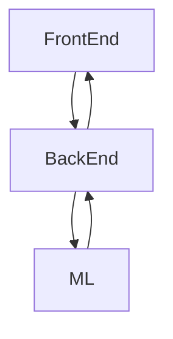

# *Future Data Prediction Of Popular Stock Data*

In this project, we're going to perform an Exploratory Data Analysis Of Popular Stocks, and make predictions for those stocks.

This project is divided into 3 services and docker-compose that contains them.


### **Front-End**
The Front-End called also 'User Interface'.
This part is the graphic part, visualization part.

Developed by:
- Streamlit - python library for UI.
- Pandas - python library for arrange the data


### **Back-End**
The Back-End called also 'Server-Side'.
The purpose of the Server is to make connection between all the services, all the connection is carried out by the server.
For example, result of ML-component like prediction, need to be printed in UI, the connection between ML and UI services is carried out by the server, and not directly.

Developed by:
- FastAPI - python library for http communication..
- Pandas - python library for arrange the data for ML.
- yfinance - python library with API to get data finance.


### **ML-service**
The ML-service is the 'brain' behind the app.
This service contains all the algorithms to predict the stocks in future, using machine-learning.


Developed by:
- FastAPI - python library for http communication..
- Pandas - python library for arrange the data for ML.
- SciKit-Learn - python library that enable us to use machine-learning.


## _FlowChart_



## _Installation_

Before getting started, we need to install the whole project, by this line in WSL:

```bash
git clone https://github.com/EASS-HIT-PART-A-2022-CLASS-II/hello-world.git
```

Now, we have install [docker-desktop](https://www.docker.com/products/docker-desktop/) and make sure that your docker-desktop is running while you need to run docker-compose.
Then, run the docker-compose with thoes lines in WSL:
```bash
docker-compose build
docker-compose up
```
## _Usage/Examples_
Copy the url below to load the 'User Interface' of project.

``` bash
http://127.0.0.1:8501/
```

Click or pase it on Http Url for load it, it will open the app.


## _Running Tests_

To run tests, run the following command

```bash
cd ex1_backend_jonathan
python tests.py
```

## More explaination
You can find more Explaination in my [YouTube video link](https://youtu.be/UGuck_zMSlo).


## _🚀 About Me_
I'm a full stack developer...

- [@JonyHack](https://github.com/EASS-HIT-PART-A-2022-CLASS-II/ex1_backend_jonathan)